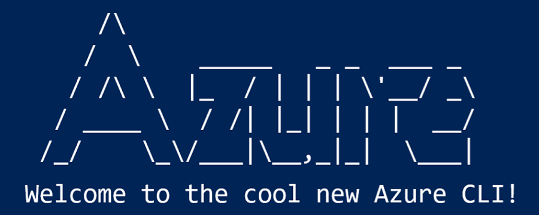
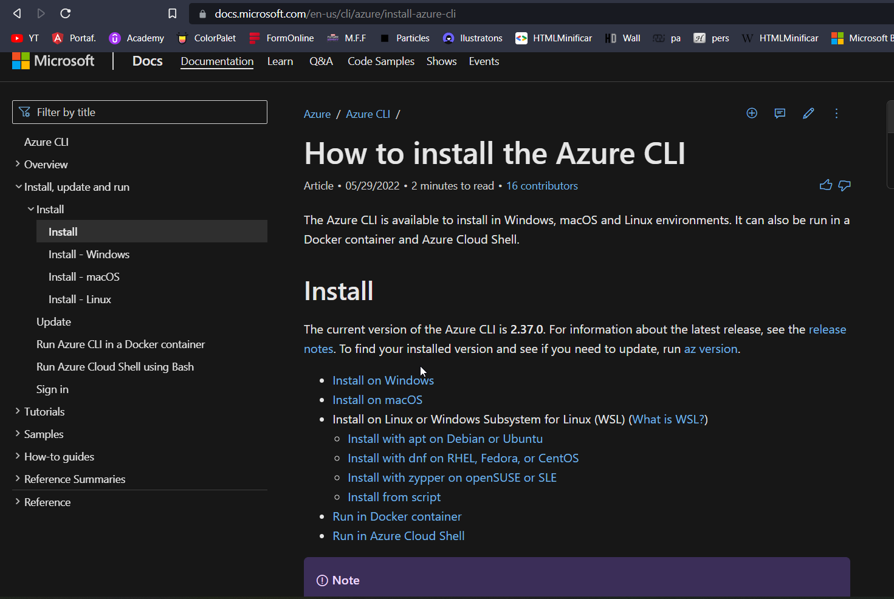
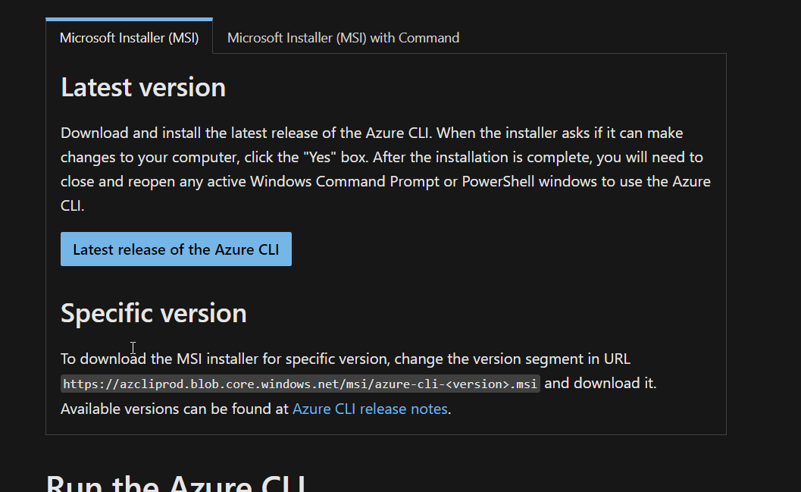
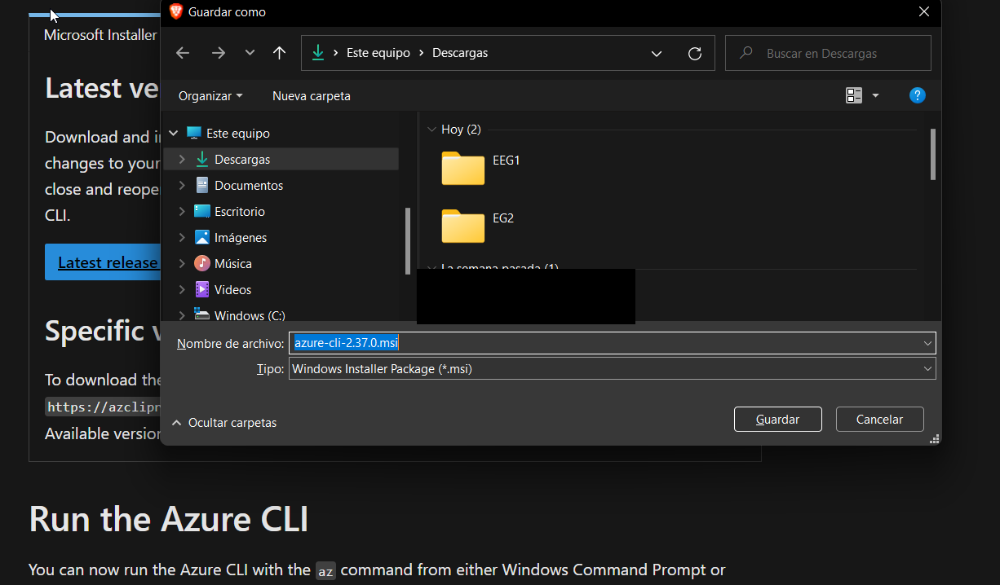
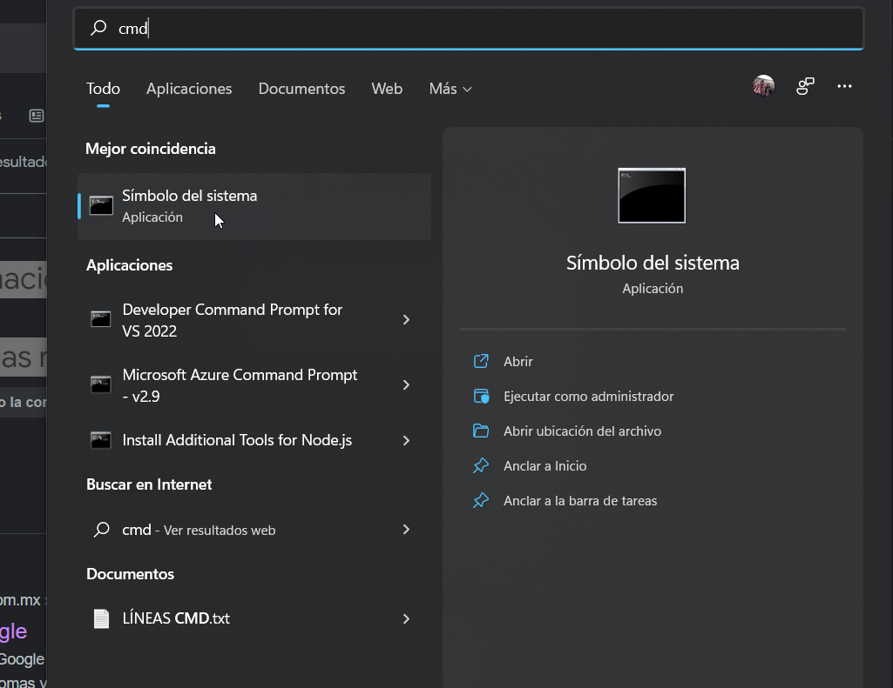
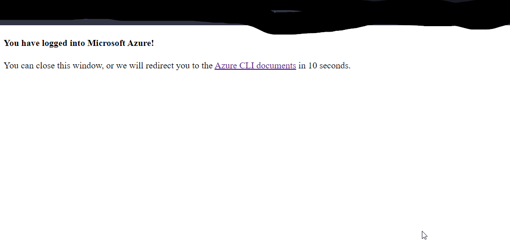
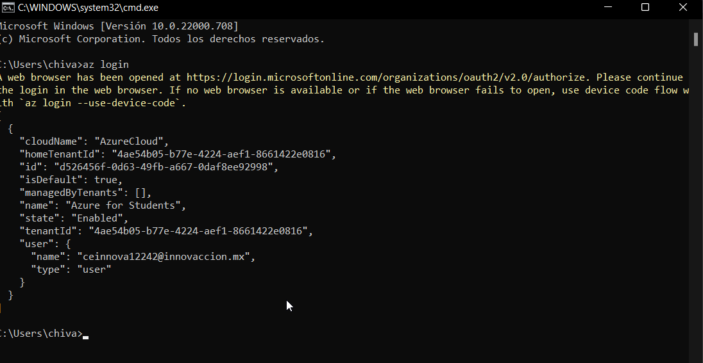
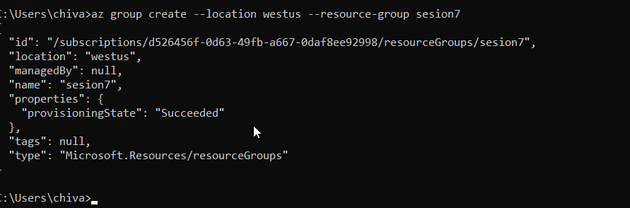
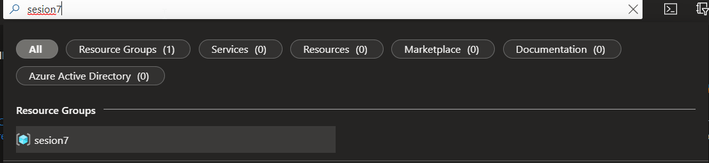
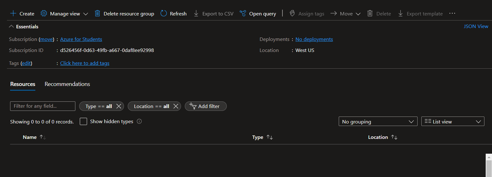

# Practice Azure CLI

----------------------------------------------------------------

 ## Process:
##### -In your default browser, search Azure CLI.
##### -Open the first link.
##### -Choose your operating system.

##### -Clic on "Latest release of the Azure CLI".

##### -Download and install the .exe

##### -When the installation is complete, open the CMD, you can search cmd or the combination of keys, Windows + r and write cmd.

##### -When the CMD is opened, write and enter:
### az login
#
##### -If it is correct, a new tab should open in your browser.

##### -In the cmd, sohuld show you the next information.

##### -Create a new resource group, with the next command.
###az group create --location westus --resource-group sesion7
##### -In westus and sesion 7, you can choose your region and another name, depend on wana you want.

##### -on the portal.azure.com portal, in the search engine, search your resource group created and click on it.

##### -You can see your new resource...

## Congratulations! you created a new group resourse on the west US from Azure CLI